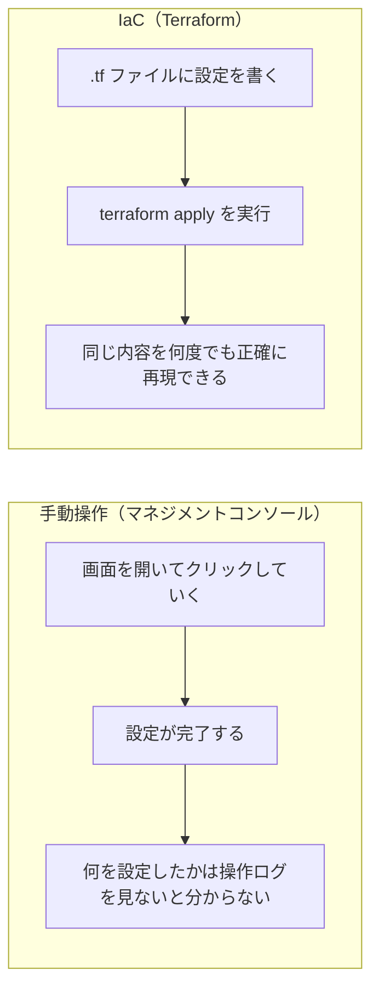
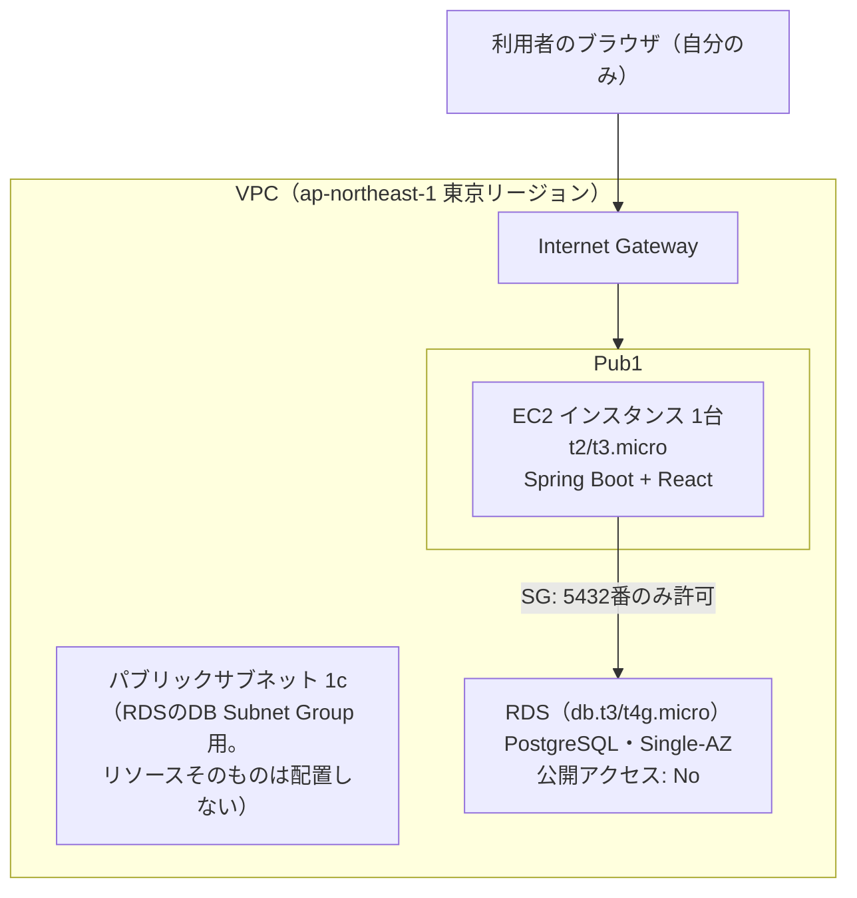
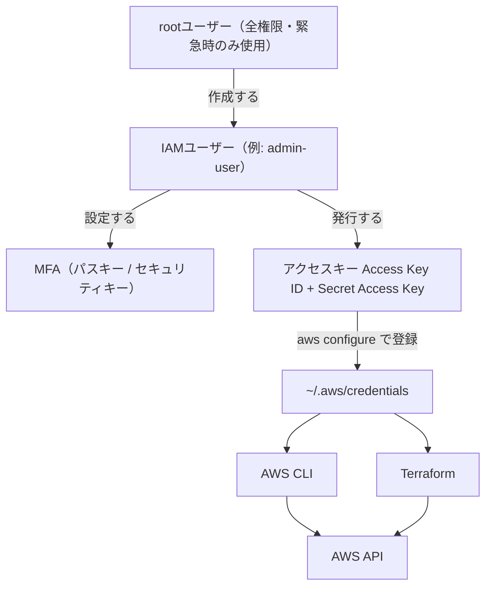
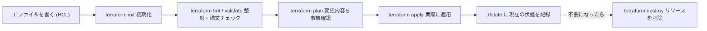

# AWSデプロイ入門ガイド
## AWS CLI × Terraform でコードからインフラを作る

マネジメントコンソールを手で操作せず、コマンドラインとコードでAWS上にデプロイするための考え方・用語・手順をまとめたもの。

- 対象読者: AWS / Terraform 未経験者
- リージョン: ap-northeast-1（東京）
- 構成: EC2 × 1 + RDS（個人利用・無料利用枠中心の最小構成）

> **このドキュメントについて。** 実装が完了しているかどうかに関わらず、AWS・Terraform・IaC の全体像を通しで説明する。すでに終わっている作業には「✅ 完了」、これから行う作業には「⬜ 未着手」の印を付けている。読み終えれば「今何が終わっていて、次に何をするか」が分かる状態を目指す。
>
> **このファイルはまだコミットしていない（レビュー・修正用のドラフト）。**

---

## 1. マネジメントコンソール操作と Terraform（IaC）の違い

AWSでサーバーやデータベースを作る方法は大きく2つある。ブラウザ上の管理画面（マネジメントコンソール）でボタンをクリックして作る方法と、設定内容をコードとして書き、そのコードをコマンドで実行して作る方法（**IaC = Infrastructure as Code**）だ。今回は後者を、**Terraform** というツールを使って行う。



| 観点 | マネジメントコンソール | Terraform（IaC） |
|---|---|---|
| 変更履歴 | 残らない（誰が何を変えたか追えない） | コードの差分としてGitに残る |
| 再現性 | 低い（毎回手作業） | 高い（同じコードで同じ環境を再現） |
| レビュー | できない | PRとして他人がレビューできる |
| 削除・後片付け | 作ったものを手動で探して消す | `terraform destroy` で一括削除 |
| 学習コスト | 低い（触ればわかる） | やや高い（HCLという文法を覚える） |

学習コストを払ってでもTerraformを使う理由は、「作って終わり」ではなく「壊してまた作る」を繰り返しながら学ぶ今回のような用途と特に相性が良いため。

---

## 2. 今回作るインフラの全体像（無料利用枠中心の最小構成）

このアプリは個人利用（認証なし・想定利用者は自分のみ）のスクール課題であり、実際のユーザーにサービスを提供するものではない。そのため、一般的なWebサービスで採用されるようなプライベートサブネット・NATゲートウェイ・ロードバランサー・Multi-AZ構成は採用せず、無料利用枠に収まる最小構成にする。



RDSは「公開アクセス: No」に設定し、インターネットから直接到達できないようにする。セキュリティグループでEC2からの5432番以外のアクセスを拒否するため、プライベートサブネットを使わなくても実用上の安全性は保てる。

| 要素 | 役割 |
|---|---|
| VPC | AWSの中に作る、自分専用の仮想ネットワーク区画 |
| Internet Gateway | VPCとインターネットをつなぐ出入り口 |
| パブリックサブネット 1a | EC2を配置するサブネット |
| パブリックサブネット 1c | リソースは置かない。RDSのDB Subnet Groupが2つ以上のAZにまたがるサブネットを要求する仕様への対応のみが目的 |
| セキュリティグループ | EC2やRDSにどのポート・どこからの通信を許可するかを決める、仮想的なファイアウォール |
| EC2 | アプリ（バックエンド・フロントエンド）を動かす仮想サーバー1台 |
| RDS | マネージド型のPostgreSQL。公開アクセスは無効にし、EC2経由でのみ接続する |

### 一般的なWebサービス構成との違い

| 採否 | コンポーネント | 一般的なWebサービス構成 | 今回の簡略化案 | 理由 |
|---|---|---|---|---|
| ✅ 採用 | サブネット構成 | パブリック＋プライベートの2種 | パブリックのみ（RDSは「公開アクセス: No」で保護） | 構成の複雑さを削減。個人利用ならSGでの制御で十分 |
| ❌ 不採用 | NATゲートウェイ | プライベートサブネットの外部通信用に必要になりがち | 使わない | 無料利用枠の対象外。時間課金＋データ処理料が発生する |
| ❌ 不採用 | ロードバランサー(ALB) | 複数台構成やSSL終端のために利用 | 使わない | 個人利用のため不要。無料利用枠の対象外でもある |
| ✅ 採用（縮小） | RDSの冗長化 | Multi-AZ（可用性重視） | Single-AZ | Multi-AZは無料利用枠の対象外（同スペックでも倍額） |
| ❌ 不採用 | Elastic IP | 固定IPが必要な場合に利用 | 使わない（EC2の自動割当パブリックIPを使用） | EIPは未アタッチ・停止中に課金される。付け忘れによる課金リスクを避ける |
| ✅ 採用 | EC2 | 用途に応じたインスタンスタイプ | t2/t3.micro 1台 | 無料利用枠の対象になりうる最小インスタンスタイプ |
| ❌ 不採用 | ECS / コンテナ化 | Fargate等でコンテナ運用 | 使わない（EC2上に直接デプロイ） | コンテナ基盤の学習コストとECRの費用を避ける |
| ❌ 不採用 | S3 + CloudFront | フロントエンドの静的配信 | 使わない（EC2上でReactビルドを配信） | 個人利用の1台構成で十分。配信の分離は不要 |

### 想定コスト比較（月額の目安）

| 項目 | 一般的なWeb構成（常時稼働の目安） | 今回の無料利用枠構成 |
|---|---|---|
| コンピューティング | ECS Fargate等：約 $10〜 | ✅ EC2 t2/t3.micro：無料利用枠の対象なら **$0** |
| データベース | RDS db.t3.micro（Multi-AZ等）：約 $15〜 | ✅ RDS db.t4g.micro（Single-AZ）：無料利用枠の対象なら **$0** |
| ロードバランサー | ALB：約 $16〜 | ❌ 不要 → **$0** |
| NATゲートウェイ | プライベートサブネット用：約 $32〜 | ❌ 不要 → **$0** |
| フロントエンド配信 | S3 + CloudFront：数 $ | ❌ 不要（EC2内で配信） → **$0** |
| コンテナレジストリ | ECR：数 $ | ❌ 不要（コンテナ化しない） → **$0** |
| **合計目安** | **約 $70〜/月** | **無料利用枠の範囲内なら $0/月** |

> 上記の金額はあくまで一般的な構成のイメージを掴むための概算であり、正確な料金ではない。実際の料金は[AWS Pricing Calculator](https://calculator.aws)や請求ダッシュボードで確認すること。

> **⚠️ 無料利用枠についての重要な注意。** AWSは2025年7月以降、新規アカウント向けの無料利用枠の制度を変更しており、従来の「特定サービスが12か月間無料」ではなく「アカウント作成から一定期間、クレジット付与」という形になっている場合がある。このアカウントの作成時期からすると新しい制度が適用されている可能性が高い。**実際に何が・いつまで無料かは、AWSマネジメントコンソールの「請求とコスト管理」→「無料利用枠」ページで必ず確認してから `terraform apply` すること。**

---

## 3. 認証の仕組みを理解する

AWSでは、**rootユーザー**（アカウント登録時のメールアドレスでログインする、全権限を持つ最上位ユーザー）を日常操作には使わない。代わりに、必要な権限だけを持つ**IAMユーザー**を作り、そのユーザーの「鍵」であるアクセスキーを使ってCLIやTerraformから操作する。



権限は個々のIAMユーザーに直接付けるのではなく、`Administrators`のような**グループ**にまとめてアタッチし、ユーザーをそのグループに所属させる形が一般的（本プロジェクトもこの構成）。

| 用語 | 意味 |
|---|---|
| rootユーザー | AWSアカウント登録時に作られる最上位ユーザー。全操作が可能なため日常利用は避け、アカウント自体の設定変更など緊急時のみ使う |
| IAMユーザー | root配下に作る、権限を絞った個別のユーザー。CLIやTerraformの操作主体として使う |
| IAM | Identity and Access Management。「誰が」「何に」「何をしてよいか」を管理するAWSの仕組み全体の名称 |
| IAMグループ | 複数のIAMユーザーにまとめて同じ権限を付与するための入れ物 |
| MFA | 多要素認証。パスワード（や鍵）に加えてもう1つの要素（パスキー・セキュリティキーなど）で本人確認する仕組み |
| アクセスキー | IAMユーザーがプログラム（CLI・Terraform等）から操作する際に使う、ID/シークレットの組み合わせの鍵 |
| ARN | Amazon Resource Name。AWS上の全リソースに割り振られる一意の識別子。`arn:aws:iam::<アカウントID>:user/admin-user` のような形式 |
| アカウントID | AWSアカウントを識別する12桁の数字。ARNの一部にも含まれる |

---

## 4. 認証設定の手順

ゼロから設定する場合の流れ。✅は本プロジェクトで既に終わっている作業。

1. **AWSアカウントを作成する** ✅完了
   メールアドレスとクレジットカードでAWSアカウントを作成する。このときのログイン情報がrootユーザーになる。

2. **rootユーザーにMFAを設定する** ✅完了
   不正アクセスされた場合の被害が最も大きいrootユーザーにこそ、真っ先にMFAを設定する。パスキー／セキュリティキー方式で設定済み。

3. **作業用のIAMユーザーとグループを作成する** ✅完了
   IAMの管理画面から、CLI・Terraform専用のIAMユーザーを作成し、`Administrators`グループに所属させる。個人の学習用途のため、グループには`AdministratorAccess`（全操作可能）を付与している。
   > 本来はチーム開発では必要最小限の権限に絞るのが望ましい。1人で学習用に使う前提での判断であることに注意。

4. **IAMユーザーにもMFAを設定する** ✅完了
   rootと同様、パスキー／セキュリティキー方式で設定済み。

5. **アクセスキーを発行する** ✅完了
   IAMユーザーの画面から「アクセスキーを作成」する。表示される Access Key ID と Secret Access Key は、この画面を閉じると二度と表示されないため、その場でパスワードマネージャーへ保存する。ダウンロードした.csvや一時メモは保存後に完全削除（ゴミ箱を空にする、まで）する。

6. **ローカルでAWS CLIを設定する** ✅完了
   ```bash
   aws configure
   ```
   実行すると `Access Key ID` → `Secret Access Key` → `Default region name` → `Default output format` の順に対話形式で聞かれるので、Access Key ID・Secret Access Keyには先ほど発行した値を、リージョンには `ap-northeast-1`、出力形式には `json` を入力する。登録先は `~/.aws/credentials`。このファイルは絶対にGitに含めない。

7. **設定が正しいか動作確認する** ✅完了
   ```bash
   aws sts get-caller-identity
   ```
   実行すると `UserId`（IAMユーザーの内部ID）・`Account`（12桁のアカウントID）・`Arn`（IAMユーザーを一意に示す文字列）の3つが表示され、想定したIAMユーザーとして認証されていることを確認できる。`Account`と`Arn`は自分のAWS環境を特定できる情報のため、この出力をスクリーンショットやドキュメントにそのまま貼り付けない。

---

## 5. AWS CLI と Terraform の役割の違い

| | AWS CLI | Terraform |
|---|---|---|
| 何をするか | AWSの機能をコマンド1つ1つ直接呼び出す | 「あるべき状態」を宣言し、現状との差分を自動で適用する |
| 向いている用途 | 単発の確認・操作（例: 状態確認、ログ取得） | インフラ全体の構築・変更管理 |
| 再実行した場合 | 同じコマンドをもう一度呼ぶだけ（重複作成に注意が必要な場合がある） | 差分がなければ何も起きない（冪等性がある） |
| 今回の使い所 | 認証設定・動作確認 | VPC・EC2・RDS等の構築 |

Terraformも内部的にはAWSのAPIを呼び出しており、そのAPIを呼ぶための認証情報は先ほど`aws configure`で設定したものをそのまま使う。つまりCLIとTerraformは認証の仕組みを共有している。

---

## 6. Terraform / IaC の基本を理解する

Terraformでは、**.tf**という拡張子のファイルに、作りたいインフラの内容を **HCL（HashiCorp Configuration Language）** という宣言的な文法で書く。「宣言的」とは、「手順」ではなく「最終的にどうあるべきか」を書くという意味。例えばEC2を1台作りたい場合、「まずAMIを選んで、次にインスタンスタイプを選んで…」という手順ではなく、「このスペックのEC2が1台ある状態」を宣言する。差分を埋める手順はTerraform自身が計算する。



| コマンド | やること |
|---|---|
| `terraform init` | 初回や新しいproviderを追加した際に実行。必要なプラグインをダウンロードする |
| `terraform fmt` | .tfファイルのインデント等を自動整形する |
| `terraform validate` | 構文的に正しいコードかをチェックする（AWS側には接続しない） |
| `terraform plan` | 現状と .tf の内容を比較し、何が作成・変更・削除されるかを事前に表示する |
| `terraform apply` | plan の内容を実際にAWS上へ適用する。確認プロンプトが出る |
| `terraform destroy` | .tfで管理しているリソースを丸ごと削除する |
| `terraform state list` | 現在Terraformが管理しているリソースの一覧を表示する |
| `terraform output` | 出力変数（例: EC2のIPアドレス）を表示する |

---

## 7. Terraform 用語集

| 用語 | 意味 | 例 |
|---|---|---|
| Provider | どのクラウド・サービスを操作するかの接続設定 | `provider "aws" { region = "ap-northeast-1" }` |
| Resource | 実際に作成する対象1つ1つ（EC2、RDSなど） | `resource "aws_instance" "app" { ... }` |
| Data Source | 既存の（Terraform管理外の）情報を参照する | `data "aws_ami" "amazon_linux" { ... }` |
| Variable | 値を外から差し替え可能にする変数 | `variable "instance_type" { default = "t2.micro" }` |
| Output | apply後に確認したい値を出力する | `output "ec2_public_ip" { value = aws_instance.app.public_ip }` |
| Module | .tfファイル群を再利用可能な部品としてまとめたもの | VPC構築用モジュールを複数環境で使い回す |
| State（tfstate） | Terraformが「今何を作ったか」を記録するファイル | `terraform.tfstate` |
| Backend | tfstateの保存先の設定。既定はローカルファイル | チーム開発では S3 + DynamoDB（ロック用）に置くのが定石 |
| Plan | 適用前の変更プレビュー | 「+作成 / ~変更 / −削除」が色分け表示される |

---

## 8. tfstate はなぜ機密情報として扱うのか

`terraform.tfstate`には、作成したリソースの詳細（RDSのエンドポイント、内部IPなど、場合によってはDBの初期パスワード等）がそのまま平文で記録される。そのためtfstateやTerraformの変数ファイル（`.tfvars`）は、アクセスキーと同じレベルの機密情報として扱う必要がある。

| ファイル | 中身 | 取り扱い |
|---|---|---|
| `*.tf` | インフラの設計図（構造のみ） | Gitにコミットして良い |
| `*.tfvars` | 実際の値（パスワード等を含みうる） | コミットしない |
| `terraform.tfstate` | 作成済みリソースの実データ | コミットしない |
| `*.pem`（SSH鍵） | EC2への接続鍵 | コミットしない |

> **本プロジェクトでの対策 ✅完了。** `terraform/.gitignore`で上記の機密ファイルを追跡対象から除外した上で、[gitleaks](https://github.com/gitleaks/gitleaks)によるpre-commitフック（`terraform/hooks/pre-commit`）を設定済み。コミットのたびに機密情報らしき文字列を自動スキャンする。新しい環境でクローンした場合は次のコマンドでフックを手動リンクする必要がある。
   ```bash
   ln -s ../../terraform/hooks/pre-commit .git/hooks/pre-commit
   chmod +x terraform/hooks/pre-commit
   ```

---

## 9. このプロジェクトの現在地

| 項目 | 状態 | 補足 |
|---|---|---|
| AWSアカウント作成 | ✅完了 | — |
| root / IAMユーザーのMFA設定 | ✅完了 | パスキー／セキュリティキー方式 |
| IAMユーザー作成・権限付与 | ✅完了 | `Administrators`グループ経由で`AdministratorAccess`を付与 |
| アクセスキー発行・保管 | ✅完了 | パスワードマネージャーに保存、csv等は削除済み |
| ローカル `aws configure` | ✅完了 | リージョン: ap-northeast-1 |
| AWS Budgets（予算アラート） | ✅完了 | 想定外課金の検知用 |
| AWS CLI / Terraform / Docker / jq インストール | ✅完了 | ローカル環境に導入済み |
| 機密情報漏洩防止（.gitignore + gitleaks） | ✅完了 | pre-commitフックで自動スキャン |
| インフラ構成の方針決定（無料利用枠中心） | ✅完了 | 本ガイド2章の通り、プライベートサブネット・NAT・ALB・Multi-AZは不採用 |
| VPC / サブネット定義（.tf） | ⬜未着手 | terraform/配下にコード未作成 |
| EC2 / セキュリティグループ定義（.tf） | ⬜未着手 | 同上 |
| RDS定義（.tf） | ⬜未着手 | 同上 |
| `terraform apply`による実デプロイ | ⬜未着手 | 上記が揃ってから |

---

## 10. 次のステップ（実装予定の大まかな流れ）

1. **providerを定義する** ⬜未着手 — 使用するクラウド（aws）とリージョン（ap-northeast-1）を最初に宣言する。
2. **ネットワーク（VPC・サブネット2つ・IGW）を定義する** ⬜未着手 — 2章の構成の器の部分から作る。
3. **セキュリティグループを定義する** ⬜未着手 — EC2には22(SSH)・80/8080番、RDSにはEC2からの5432番のみ許可、のように必要最小限の穴だけを開ける。
4. **RDS・EC2を定義する** ⬜未着手 — 無料利用枠の対象インスタンスタイプ（例: db.t3.micro/db.t4g.micro、t2.micro/t3.micro）を選定する。RDSは`publicly_accessible = false`にする。
5. **`terraform plan`で内容を確認する** ⬜未着手 — 意図しないリソースが作られないか、課金が発生する変更でないかをここで必ず確認する。
6. **`terraform apply`で適用する** ⬜未着手 — 確認プロンプトで`yes`と入力すると実際にAWS上にリソースが作られる。

> **課金についての注意。** 無料利用枠対象外のインスタンスタイプ・NATゲートウェイ・Multi-AZ等を誤って指定すると課金が発生する。`plan`の出力を毎回確認する習慣と、既に設定済みのAWS Budgetsのアラートが二重のセーフティネットになる。使い終わったリソースは`terraform destroy`で忘れずに片付ける。

---

*task-management / docs/aws-infrastructure.md を基にした学習用リファレンス — 実装が進み次第、同ドキュメントへ追記していく*
