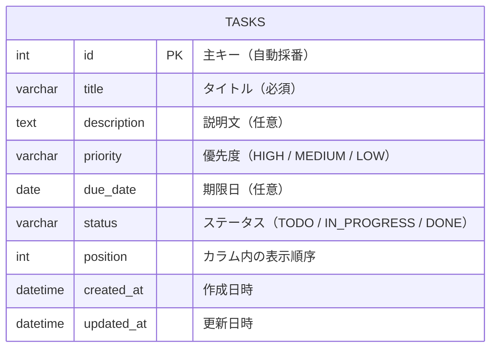

# データベース設計書

## 1. ER図

---

## 2. テーブル定義

### 2.1 tasks テーブル

| カラム名 | データ型 | NULL | 初期値 | 説明 |
|----------|---------|------|--------|------|
| id | INT | 不可 | 自動採番 | 主キー |
| title | VARCHAR(255) | 不可 | なし | タスクのタイトル |
| description | TEXT | 可 | NULL | タスクの説明文 |
| priority | VARCHAR(10) | 可 | NULL | 優先度：`HIGH` / `MEDIUM` / `LOW` |
| due_date | DATE | 可 | NULL | 期限日 |
| status | VARCHAR(20) | 不可 | `TODO` | ステータス：`TODO` / `IN_PROGRESS` / `DONE` |
| position | INT | 不可 | `0` | カラム内の表示順序 |
| created_at | DATETIME | 不可 | 現在日時 | レコード作成日時（内部管理用・画面には表示しない） |
| updated_at | DATETIME | 不可 | 現在日時 | レコード更新日時（内部管理用・画面には表示しない） |

---

### 2.2 インデックス

| インデックス名 | 対象カラム | 用途 |
|--------------|-----------|------|
| idx_tasks_status | status | ステータスによるタスク取得の高速化 |
| idx_tasks_status_position | status, position | カラム内の表示順ソートの高速化 |

---

### 2.3 制約

- `priority` は `'HIGH'`、`'MEDIUM'`、`'LOW'` のいずれかの値をとる
- `status` は `'TODO'`、`'IN_PROGRESS'`、`'DONE'` のいずれかの値をとる
- `title` は空文字を許可しない
