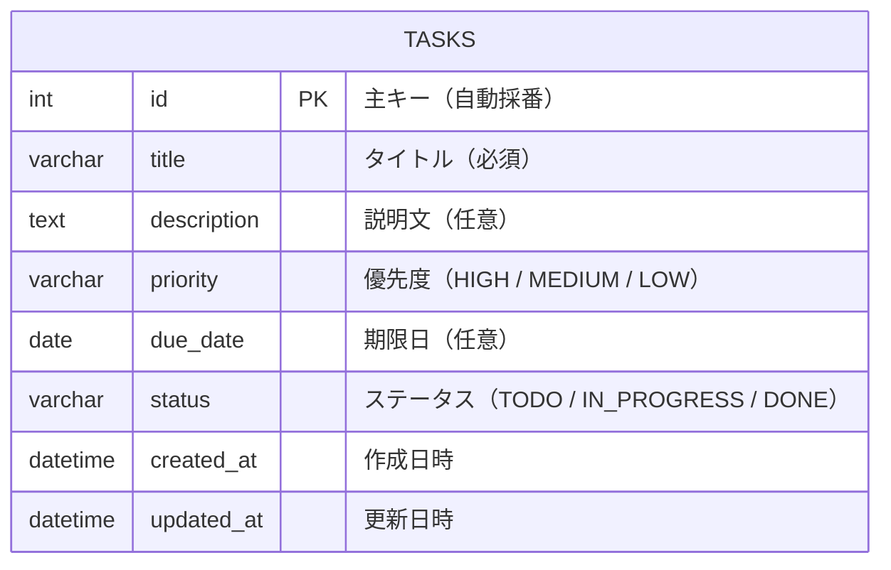
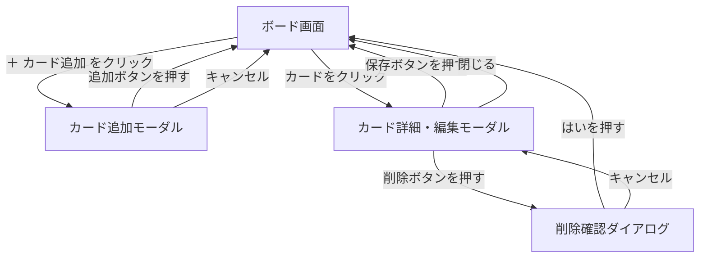
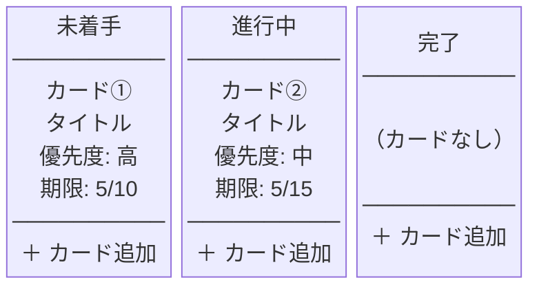

# タスク管理アプリ 要件定義書

---

## 1. プロジェクト概要

個人で使える Trello 風のタスク管理アプリ。
カンバンボード形式でタスクを視覚的に管理できる。
スクールの課題として作成する。

| 項目 | 内容 |
|------|------|
| アプリ名 | タスク管理アプリ |
| 用途 | 個人のタスクを整理・管理する |
| 利用形態 | PC ブラウザで使う Web アプリ |
| マルチユーザー対応 | 対応しない（ログイン機能・ユーザー管理なし） |

---

## 2. ターゲットユーザー

- 自分自身（個人利用のみ）

---

## 3. 機能要件

### 3-1. カラム（列）

- 3つのカラムを表示する
  - `未着手` / `進行中` / `完了`
- カラムの順番は固定

### 3-2. カード（タスク）の操作

| 操作 | 内容 |
|------|------|
| 追加 | カラムにカードを新規追加できる |
| 削除 | カードを削除できる |
| 編集 | タイトル・説明文・期限・優先度を変更できる |
| 移動 | ドラッグ＆ドロップで別のカラムに移動できる |
| 詳細表示 | カードをクリックすると詳細モーダルが開く |

### 3-3. カードが持つ情報

| 項目 | 必須 / 任意 | 表示場所 |
|------|------------|---------|
| タイトル | 必須 | カード一覧・詳細 |
| 説明文 | 任意 | 詳細モーダルのみ |
| 優先度（高・中・低） | 任意 | カード一覧・詳細 |
| 期限（日付） | 任意 | カード一覧・詳細 |

### 3-4. データの保存

- タスクのデータはサーバー側のデータベース（DB）に保存する
- ブラウザの localStorage は使用しない
- ブラウザを閉じてもデータが消えないようにする

---

## 4. 非機能要件

| 項目 | 内容 |
|------|------|
| UI のシンプルさ | 直感的に使えること |
| 対象デバイス | PC のみ（スマートフォン・タブレットは対象外） |
| 対応ブラウザ | Google Chrome 最新版 |
| 認証 | なし（マルチユーザー対応しないため） |
| エラー表示 | API 通信が失敗した場合、画面にエラーメッセージを表示する |

---

## 5. 画面一覧

| No. | 画面名 | 概要 |
|-----|--------|------|
| 1 | ボード画面 | アプリのメイン画面。3つのカラムとカードを一覧表示する |
| 2 | カード追加モーダル | 「＋ カード追加」ボタンで開く。タイトルなどを入力して新規作成する |
| 3 | カード詳細・編集モーダル | カードをクリックすると開く。内容の確認・編集・削除ができる。削除時は確認ダイアログを表示する |

---

## 6. 機能一覧・ユースケース

### 6-1. 機能一覧

| No. | 機能名 | 説明 |
|-----|--------|------|
| F-01 | タスク追加 | 新しいタスクを作成してカラムに追加する |
| F-02 | タスク詳細表示 | タスクの詳細情報をモーダルで表示する |
| F-03 | タスク編集 | タスクのタイトル・説明文・優先度・期限を変更する |
| F-04 | タスク削除 | 不要なタスクを削除する |
| F-05 | タスク移動 | ドラッグ＆ドロップでカラム間を移動しステータスを変更する |

### 6-2. ユースケース

アクター：利用者（自分自身）

| ユースケース | 操作の流れ |
|-------------|-----------|
| タスクを追加する | ① 「＋ カード追加」をクリック → ② モーダルに入力 → ③「追加」ボタンを押す → ④ カードが一覧に表示される |
| タスクを確認する | ① カードをクリック → ② 詳細モーダルで内容を確認する |
| タスクを編集する | ① カードをクリック → ② 詳細モーダルで内容を変更 → ③「保存」ボタンを押す → ④ 更新内容が反映される |
| タスクを削除する | ① カードをクリック → ② 「削除」ボタンを押す → ③ 確認ダイアログが表示される → ④「はい」を押す → ⑤ カードが一覧から消える |
| タスクを移動する | ① カードをドラッグ → ② 別のカラムにドロップ → ③ ステータスが自動更新される |
| バリデーション | タイトルが未入力の状態で「追加」または「保存」を押すとエラーメッセージを表示し、保存しない |

---

## 7. データ設計（ER テーブル定義）

### 7-1. ER 図



### 7-2. tasks テーブル定義

| カラム名 | データ型 | NULL | 初期値 | 説明 |
|----------|---------|------|--------|------|
| id | INT | 不可 | 自動採番 | 主キー |
| title | VARCHAR(255) | 不可 | なし | タスクのタイトル |
| description | TEXT | 可 | NULL | タスクの説明文 |
| priority | VARCHAR(10) | 可 | NULL | 優先度：`HIGH` / `MEDIUM` / `LOW` |
| due_date | DATE | 可 | NULL | 期限日 |
| status | VARCHAR(20) | 不可 | `TODO` | ステータス：`TODO` / `IN_PROGRESS` / `DONE` |
| created_at | DATETIME | 不可 | 現在日時 | レコード作成日時（画面には表示しない・内部管理用） |
| updated_at | DATETIME | 不可 | 現在日時 | レコード更新日時（画面には表示しない・内部管理用） |

---

## 8. 技術構成

| 役割 | 使用技術 |
|------|---------|
| フロントエンド | React + TypeScript |
| ビルドツール | Vite |
| スタイリング | Tailwind CSS |
| ドラッグ＆ドロップ | @dnd-kit/core |
| バックエンド | Java / Spring Boot |
| データベース | PostgreSQL（または H2） |
| API 通信 | REST API |

### API エンドポイント一覧

| メソッド | URL | 処理内容 |
|---------|-----|---------|
| GET | `/api/tasks` | 全タスクを取得する |
| POST | `/api/tasks` | 新しいタスクを作成する |
| PUT | `/api/tasks/{id}` | 指定した ID のタスクを更新する |
| DELETE | `/api/tasks/{id}` | 指定した ID のタスクを削除する |

---

## 9. 画面遷移図



---

## 10. ワイヤーフレーム

### 10-1. ボード画面



### 10-2. カード追加モーダル

```
┌─────────────────────────────┐
│  カードを追加                 │
│                               │
│  タイトル（必須）              │
│  ┌───────────────────────┐   │
│  │                       │   │
│  └───────────────────────┘   │
│                               │
│  説明文（任意）                │
│  ┌───────────────────────┐   │
│  │                       │   │
│  └───────────────────────┘   │
│                               │
│  優先度    ○高  ○中  ○低      │
│                               │
│  期限  [____/____/____]       │
│                               │
│      [キャンセル] [追加する]    │
└─────────────────────────────┘
```

### 10-3. カード詳細・編集モーダル

```
┌─────────────────────────────┐
│  タスク詳細                   │
│                               │
│  タイトル                     │
│  ┌───────────────────────┐   │
│  │                       │   │
│  └───────────────────────┘   │
│                               │
│  説明文                       │
│  ┌───────────────────────┐   │
│  │                       │   │
│  └───────────────────────┘   │
│                               │
│  優先度    ○高  ○中  ○低      │
│  期限  [____/____/____]       │
│                               │
│  [削除する]  [キャンセル] [保存する] │
└─────────────────────────────┘
```

### 10-4. 削除確認ダイアログ（10-3 の上に重なって表示）

```
┌─────────────────────────────┐
│                               │
│  本当に削除しますか？          │
│                               │
│       [キャンセル]  [はい]     │
│                               │
└─────────────────────────────┘
```
