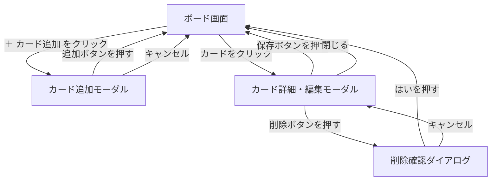
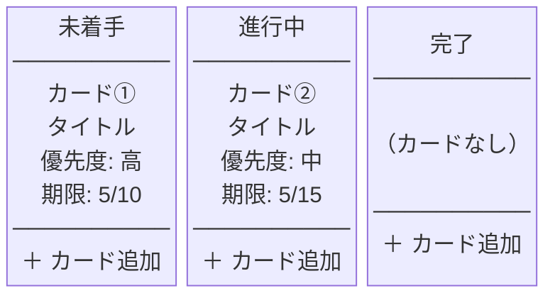

# 画面設計書

## 1. 画面一覧

| No. | 画面名 | 概要 |
|-----|--------|------|
| 1 | ボード画面 | アプリのメイン画面。3つのカラムとカードを一覧表示する |
| 2 | カード追加モーダル | 「＋ カード追加」ボタンで開く。タイトルなどを入力して新規作成する |
| 3 | カード詳細・編集モーダル | カードをクリックすると開く。内容の確認・編集・削除ができる |
| 4 | 削除確認ダイアログ | 削除ボタン押下時に表示する確認画面 |

---

## 2. 画面遷移図



---

## 3. ワイヤーフレーム

### 3-1. ボード画面



### 3-2. カード追加モーダル

```
┌─────────────────────────────┐
│  カードを追加                 │
│                               │
│  タイトル（必須）              │
│  ┌───────────────────────┐   │
│  │                       │   │
│  └───────────────────────┘   │
│                               │
│  説明文（任意）                │
│  ┌───────────────────────┐   │
│  │                       │   │
│  └───────────────────────┘   │
│                               │
│  優先度    ○高  ○中  ○低      │
│                               │
│  期限  [____/____/____]       │
│                               │
│      [キャンセル] [追加する]    │
└─────────────────────────────┘
```

### 3-3. カード詳細・編集モーダル

```
┌─────────────────────────────┐
│  タスク詳細                   │
│                               │
│  タイトル                     │
│  ┌───────────────────────┐   │
│  │                       │   │
│  └───────────────────────┘   │
│                               │
│  説明文                       │
│  ┌───────────────────────┐   │
│  │                       │   │
│  └───────────────────────┘   │
│                               │
│  優先度    ○高  ○中  ○低      │
│  期限  [____/____/____]       │
│                               │
│  [削除する]  [キャンセル] [保存する] │
└─────────────────────────────┘
```

### 3-4. 削除確認ダイアログ

```
┌─────────────────────────────┐
│                               │
│  本当に削除しますか？          │
│                               │
│       [キャンセル]  [はい]     │
│                               │
└─────────────────────────────┘
```
