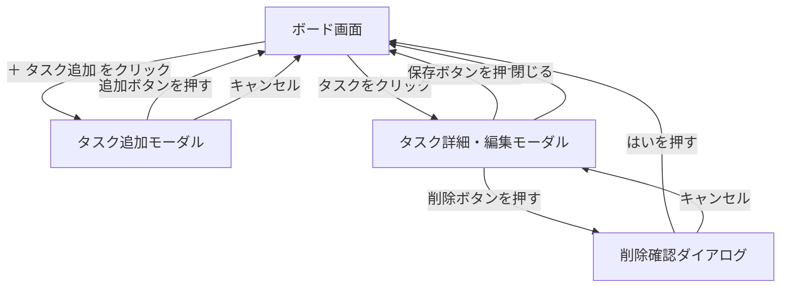

# 画面設計書

## 1. 画面一覧

| No. | 画面名 | 概要 |
|-----|--------|------|
| 1 | ボード画面 | アプリのメイン画面。3つのカラムとタスクを一覧表示する |
| 2 | タスク追加モーダル | 「＋ タスク追加」ボタンで開く。タイトルなどを入力して新規作成する |
| 3 | タスク詳細・編集モーダル | タスクをクリックすると開く。内容の確認・編集・削除ができる |
| 4 | 削除確認ダイアログ | 削除ボタン押下時に表示する確認画面 |

---

## 2. 画面遷移図



---

## 3. ワイヤーフレーム

### 3-1. ボード画面

```
[Task Board]

┌──────────────────────────────────────────────────────────────┐
│  未着手                      進行中               完了        │
│  [登録順][優先度順][期限順]  [登録順][優先度順][期限順]  [全削除][登録順][優先度順][期限順] │
│  ──────────────             ─────────────       ─────────── │
│  タスク①                    タスク②              （タスクがありません）│
│  タイトル                    タイトル                         │
│  優先度: 高                  優先度: 中                       │
│  期限: 5/10                  期限: 5/15                       │
│  ──────────────             ─────────────       ─────────── │
│  ＋ タスク追加               （タスクがありません）             │
└──────────────────────────────────────────────────────────────┘
```

- ヘッダーにアプリ名「Task Board」を表示する
- 各カラムに並び替えボタン（登録順・優先度順・期限順）を表示する
- 完了カラムにのみ「全削除」ボタンを表示する
- 「＋ タスク追加」ボタンは未着手カラムにのみ表示する
- カラムが空の場合「タスクがありません」と表示する
- タスクはドラッグ＆ドロップでカラム間・カラム内を移動できる

### 3-2. タスク追加モーダル

```
┌─────────────────────────────┐
│  タスクを追加                 │
│                               │
│  タイトル（必須）              │
│  ┌───────────────────────┐   │
│  │                       │   │
│  └───────────────────────┘   │
│                               │
│  説明文（任意）                │
│  ┌───────────────────────┐   │
│  │                       │   │
│  └───────────────────────┘   │
│                               │
│  優先度    ○高  ○中  ○低      │
│                               │
│  期限  [____/____/____]       │
│                               │
│      [キャンセル] [追加する]    │
└─────────────────────────────┘
```

### 3-3. タスク詳細・編集モーダル

```
┌─────────────────────────────┐
│  タスク詳細                   │
│                               │
│  タイトル                     │
│  ┌───────────────────────┐   │
│  │                       │   │
│  └───────────────────────┘   │
│                               │
│  説明文                       │
│  ┌───────────────────────┐   │
│  │                       │   │
│  └───────────────────────┘   │
│                               │
│  優先度    ○高  ○中  ○低      │
│  期限  [____/____/____]       │
│                               │
│  [削除する]  [キャンセル] [保存する] │
└─────────────────────────────┘
```

### 3-4. 削除確認ダイアログ

```
┌─────────────────────────────┐
│                               │
│  本当に削除しますか？          │
│                               │
│       [キャンセル]  [はい]     │
│                               │
└─────────────────────────────┘
```
